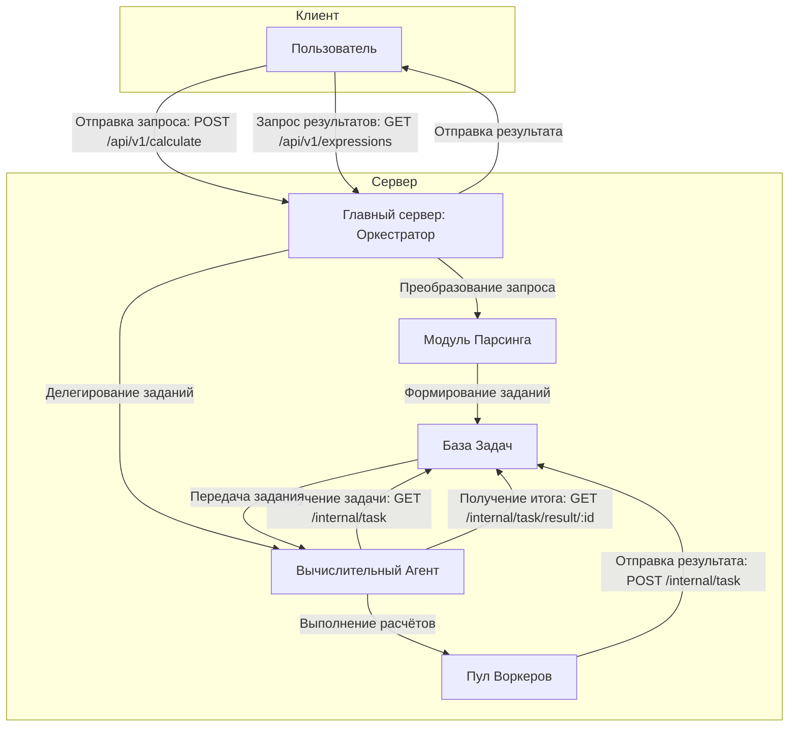

# GoCalculator2.0-Distributed
---

Распределённая система для вычисления математических выражений с использованием параллельных вычислений. Проект состоит из двух основных компонентов – **Оркестратора** и **Агента**, взаимодействующих через REST API.

---

## Содержание

- [Описание проекта](#описание-проекта)
- [Архитектура системы](#архитектура-системы)
- [Установка и запуск](#установка-и-запуск)
  - [Требования](#требования)
  - [Клонирование репозитория](#клонирование-репозитория)
  - [Запуск с Docker Compose](#запуск-с-помощью-docker-compose)
  - [Локальный запуск](#локальный-запуск)
- [Конфигурация](#конфигурация)
- [Документация API](#документация-api)
- [Примеры использования](#примеры-использования)
- [Тестирование](#тестирование)
- [Внесение вклада](#внесение-вклада)
- [Известные проблемы и FAQ](#известные-проблемы-и-faq)
- [Технологии и зависимости](#технологии-и-зависимости)
- [Контакты](#контакты)
- [Лицензия](#лицензия)

---

## Описание проекта

**Web Calculator** – система для асинхронного вычисления сложных арифметических выражений. Приложение разбивает выражение на атомарные операции и распределяет вычисления между агентами, что позволяет:

- Масштабировать систему за счёт добавления новых вычислительных узлов.
- Обрабатывать большое количество запросов одновременно.
- Симулировать задержки выполнения операций через настраиваемые переменные окружения (удобно для тестирования распределённых вычислений).

Проект был создан как итоговое задание для обучения программированию на Go и демонстрирует принципы распределённых вычислений, управления задачами и интеграции компонентов через REST API.

---

## Архитектура системы

### Компоненты

1. **Оркестратор**
   - Принимает запросы от пользователя.
   - Преобразует арифметические выражения в набор задач.
   - Управляет очередью задач и собирает результаты вычислений.

2. **Агент**
   - Получает задачи от оркестратора.
   - Выполняет операции (с имитацией задержек) с последующей отправкой результатов обратно.

### Схема взаимодействия



*Примечание:* В первоначальном варианте был представлен и простой текстовый вариант работы, но приведённая выше схема (на основе Mermaid) считается более наглядной и удобной для понимания.

---

## Установка и запуск

### Требования

- **Go** версии 1.20+
- **Docker** и **Docker Compose** (для контейнеризации)
- Git
- Любой HTTP-клиент (curl, Postman, Git bash и т.д.)

### Клонирование репозитория

```bash
git clone https://github.com/your_username/web-calculator.git
cd web-calculator
```

### Запуск с помощью Docker Compose

В корневой директории проекта выполните команду:

```bash
docker-compose up --build
```
После этого запустятся:
- **Оркестратор** – доступен по адресу: [http://localhost:8080](http://localhost:8080)
- **API** – по адресу: [http://localhost:8080/api/v1](http://localhost:8080/api/v1)
- **Агент(ы)** – работают параллельно, если их несколько
  
### Локальный запуск

1. **Установка зависимостей:**

   ```bash
   go mod download
   ```

2. **Запуск оркестратора:**

   ```bash
   go run ./cmd/orchestrator/main.go
   ```

3. **Запуск агента (в отдельном терминале):**

   ```bash
   go run ./cmd/agent/main.go
   ```

После этого запустятся:
- **Оркестратор** – доступен по адресу: [http://localhost:8080](http://localhost:8080)
- **API** – по адресу: [http://localhost:8080/api/v1](http://localhost:8080/api/v1)
- **Агент(ы)** – работают параллельно, если их несколько
---

## Конфигурация

Перед запуском установите необходимые переменные окружения. В объединённом варианте объединены сведения из обоих README:

| Переменная         | Описание                                      |
|--------------------|-----------------------------------------------|
| `PORT`             | Порт оркестратора (по умолчанию 8080)         |
| `COMPUTING_POWER`  | Количество воркеров                           |
| `TIME_ADDITION_MS` | Задержка для операции сложения (мс)           |
| `TIME_SUBTRACTION_MS` | Задержка для операции вычитания (мс)       |
| `TIME_MULTIPLICATION_MS` | Задержка для операции умножения (мс)    |
| `TIME_DIVISION_MS` | Задержка для операции деления (мс)            |
| `ORCHESTRATOR_ADDR`| Адрес оркестратора (например, ":8080")         |

### Пример для Windows (Git bash) и macOS/Linux (bash)

```bash
export PORT=8080
export COMPUTING_POWER=5
export TIME_ADDITION_MS=200
export TIME_SUBTRACTION_MS=150
export TIME_MULTIPLICATION_MS=100
export TIME_DIVISION_MS=250
export ORCHESTRATOR_ADDR=":8080"
```

### Пример для Windows (PowerShell)

```powershell
$env:PORT = 8080
$env:COMPUTING_POWER = 5
$env:TIME_ADDITION_MS = 200
$env:TIME_SUBTRACTION_MS = 150
$env:TIME_MULTIPLICATION_MS = 100
$env:TIME_DIVISION_MS = 250
$env:ORCHESTRATOR_ADDR = ":8080"
```

---

## Документация API

### Публичные эндпоинты (для пользователей)

1. **Отправка выражения для вычисления**
   - **URL:** `/api/v1/calculate`
   - **Метод:** `POST`
   - **Тело запроса (JSON):**
     ```json
     {
       "expression": "2 + 2 * 2"
     }
     ```
   - **Ответ:** Код `201 Created` с уникальным идентификатором или `422 Unprocessable Entity` при ошибке.

2. **Получение списка выражений**
   - **URL:** `/api/v1/expressions`
   - **Метод:** `GET`
   - **Ответ:** JSON со списком выражений, их статусами и результатами.

3. **Получение результата выражения по ID**
   - **URL:** `/api/v1/expressions/{id}`
   - **Метод:** `GET`
   - **Ответ:** JSON с данными конкретного выражения или `404 Not Found`, если выражение отсутствует.

4. **Просмотр незавершённых задач**
   - **URL:** `/api/v1/pending-tasks`
   - **Метод:** `GET`

### Внутренние эндпоинты (для агентов)

1. **Получение задачи для вычисления**
   - **URL:** `/internal/task`
   - **Метод:** `GET`
   - **Пример ответа:**
     ```json
     {
       "task": {
         "id": "7",
         "arg1": 3,
         "arg2": 4,
         "operation": "+",
         "operation_time": 200
       }
     }
     ```

2. **Отправка результата задачи**
   - **URL:** `/internal/task`
   - **Метод:** `POST`
   - **Тело запроса (JSON):**
     ```json
     {
       "id": "7",
       "result": 7
     }
     ```
   - **Ответ:** Код `200 OK` при успешном выполнении или `404/422` при ошибках.

---

## Примеры использования

### Отправка арифметического выражения

```bash
curl -X POST http://localhost:8080/api/v1/calculate \
     -H "Content-Type: application/json" \
     -d '{"expression": "2 + 2 * 2"}'
```

### Получение списка выражений

```bash
curl http://localhost:8080/api/v1/expressions
```

### Получение результата конкретного выражения

```bash
curl http://localhost:8080/api/v1/expressions/12345
```

### Работа агента: получение задачи и отправка результата

1. **Получение задачи:**

   ```bash
   curl http://localhost:8080/internal/task
   ```

2. **Отправка результата:**

   ```bash
   curl -X POST http://localhost:8080/internal/task \
        -H "Content-Type: application/json" \
        -d '{"id": "7", "result": 7}'
   ```

---

## Тестирование 

- **Тестирование:** Проект покрыт автоматизированными тестами. Запустить тесты можно командой:
  ```bash
  go test ./...
  ```
---

## Внесение вклада

- Создавайте issues и пулл-реквесты с подробным описанием ваших замечаний.

---

## Известные проблемы и FAQ

- **Некорректные выражения:** Убедитесь, что выражение содержит допустимые символы и правильно расставлены скобки.
- **Ошибка 422 при запросе:** Проверьте, что JSON-запрос сформирован корректно и содержит поле `expression`.
- **Вопросы по производительности:** Проверьте настройки переменных окружения, влияющих на задержки операций.

Если возникли дополнительные вопросы, откройте issue в репозитории или свяжитесь с мной в [тг](https://t.me/Shi_v_borshi).

---

## Технологии и зависимости

- **Язык:** Go
- **Контейнеризация:** Docker, Docker Compose
- **API:** RESTful
- **Тестирование:** Go testing framework

_Полезные ссылки:_
- [Go Documentation](https://golang.org/doc/)
- [Docker Documentation](https://docs.docker.com/)
- [REST API Guidelines](https://restfulapi.net/)

---

## Контакты

Если у вас возникли вопросы замечания или предложения:

- **Telegram:** [@Shi_v_borshi](https://t.me/Shi_v_borshi)

---

## Лицензия

Проект распространяется под лицензией [MIT](LICENSE).

---
